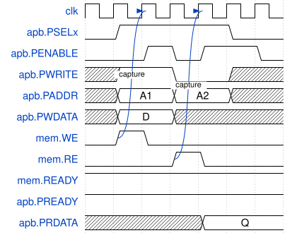
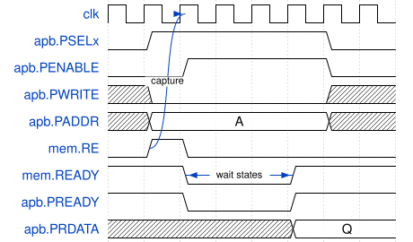

# Module Specification: `APB_to_Memory`

> **Source:** `ts/src/modules/APB_to_Memory/`
> **Status:** Approved

---

## Overview

A thin combinational adapter that converts an APB4 slave interface into a Memory master interface. It is intended to be instantiated as a submodule inside a `RegisterBlock` when `busInterface` is set to `'APB'`, allowing register blocks to be accessed over an APB4 bus. It follows the `Memory` contract ([`doc/reference/Memory.md`](../../reference/Memory.md#memory)): it issues the one-cycle Memory request in the APB setup phase, and ends the APB access phase when the slave's `READY` is high. A zero-wait slave, such as a `RegisterBlock`, completes every transfer with no APB wait states; a slave that inserts Memory wait states inserts the same number of APB wait states. All signal assignments are combinational `assign` statements, and the module has no state of its own.

---

## Parameters

Defined in `APB_to_Memory_Parameters extends TSSVParameters`.

| Parameter | Type | Default | Description |
|---|---|---|---|
| `name` | `string` | `'APB_to_Memory'` | Instance name |
| `DATA_WIDTH` | `32 \| 64 \| 128 \| 256 \| 512 \| 1024` | `32` | Data bus width in bits; must match the attached RegisterBlock's `wordSize` |
| `ADDR_WIDTH` | `IntRange<16, 64>` | `32` | Address bus width in bits |

---

## IO Ports

| Port | Direction | Width | Clock/Reset | Description |
|---|---|---|---|---|
| `clk` | `input` | 1 | `isClock: 'posedge'` | System clock (unused internally; present for interface consistency) |
| `rst_b` | `input` | 1 | `isReset: 'lowasync'` | Active-low async reset (unused internally; present for interface consistency) |

### Interfaces

| Interface | Role | Description |
|---|---|---|
| `apb` | APB4 inward (slave) | APB4 bus port — driven by the APB master |
| `mem` | Memory outward (master) | Memory bus port — drives the attached RegisterBlock, or any slave that follows the Memory contract |

---

## Functional Description

All logic is purely combinational. There are no registers and no state. The timing comes from APB's two phases: the setup phase is the Memory request cycle, and the access phase lasts until the Memory access settles.

### Signal mapping

| APB4 signal | Direction | Memory signal | Direction | Notes |
|---|---|---|---|---|
| `apb.PADDR` | in → | `mem.ADDR` | → out | Address passes straight through |
| `apb.PWDATA` | in → | `mem.DATA_WR` | → out | Write data passes straight through |
| `apb.PSTRB` | in → | `mem.WSTRB` | → out | Byte strobes pass straight through |
| `mem.DATA_RD` | ← in | `apb.PRDATA` | ← out | Read data passes straight back |
| — | — | `mem.WE` | → out | `PSELx & ~PENABLE & PWRITE` — the setup phase of a write |
| — | — | `mem.RE` | → out | `PSELx & ~PENABLE & ~PWRITE` — the setup phase of a read |
| `mem.READY` | ← in | `apb.PREADY` | ← out | Passes straight back: the access phase ends when the Memory access has settled |
| — | — | `apb.PSLVERR` | ← out | Tied to `0` — no error conditions |

### Normal operation

1. **Setup phase.** The APB master asserts `PSELx` with `PENABLE` low, and drives `PADDR`, `PWRITE`, and for a write `PWDATA` and `PSTRB`.
   - Write: `mem.WE` is high for this one cycle, with `mem.ADDR`, `mem.DATA_WR` and `mem.WSTRB`.
   - Read: `mem.RE` is high for this one cycle, with `mem.ADDR`.
2. The slave captures the request on the rising edge that ends the setup phase.
3. **Access phase.** The APB master asserts `PENABLE`. `mem.WE`/`mem.RE` are low again, so each APB transfer makes exactly one Memory request.
4. `PREADY` follows `mem.READY`. A zero-wait slave keeps `READY` high, so the transfer completes in the first access cycle. A slave with wait states holds `READY` low until its access settles, and the APB access phase lasts until then.
5. For a read, `PRDATA` follows `mem.DATA_RD`, which the slave holds valid while `READY` is high after the read.
6. APB keeps `PADDR`, `PWDATA` and `PSTRB` stable until the transfer completes, so the Memory master's hold rule (address and write data held until `READY` is high again) needs no logic.
7. `PSLVERR` is permanently tied low — error signalling is not supported.

### Reset behavior

No state to reset. All outputs are combinational functions of the current APB inputs and `mem.READY`/`mem.DATA_RD`.

### Edge cases

- **Wait states:** Passed through. Each cycle the slave holds `mem.READY` low becomes an APB wait state. A `RegisterBlock` never inserts any.
- **Back-to-back transfers:** A setup phase can follow an access phase directly. The slave's `READY` is high when the previous transfer completes, which is the condition the Memory contract puts on a new request.
- **`PREADY` outside a transfer:** It follows `mem.READY` whether or not `PSELx` is high. APB only samples it in the access phase.
- **`PSLVERR`:** Always 0. The module assumes the attached RegisterBlock never generates errors.
- **Simultaneous RE/WE:** Cannot occur by APB4 protocol — `PWRITE` is mutually exclusive.

---

## Timing

A write and a read back to back, against a zero-wait slave. The arrow marks the edge on which the slave captures each request. The read's data is valid from the access phase until the next request.

<!-- wavedrom APB_to_Memory-timing-zero-wait.svg
{
  "signal": [
    {"name": "clk",         "wave": "p......", "node": "..C.D"},
    {"name": "apb.PSELx",   "wave": "01...0."},
    {"name": "apb.PENABLE", "wave": "0.101.0"},
    {"name": "apb.PWRITE",  "wave": "x1.0.x."},
    {"name": "apb.PADDR",   "wave": "x=.=.x.", "data": ["A1", "A2"]},
    {"name": "apb.PWDATA",  "wave": "x=.x...", "data": ["D"]},
    {"name": "mem.WE",      "wave": "010....", "node": ".A"},
    {"name": "mem.RE",      "wave": "0..10..", "node": "...B"},
    {"name": "mem.READY",   "wave": "1......"},
    {"name": "apb.PREADY",  "wave": "1......"},
    {"name": "apb.PRDATA",  "wave": "x...=..", "data": ["Q"]}
  ],
  "edge": ["A~>C capture", "B~>D capture"]
}
-->



A read against a slave that inserts three wait states. The APB access phase lasts until the slave's `READY` rises.

<!-- wavedrom APB_to_Memory-timing-wait-states.svg
{
  "signal": [
    {"name": "clk",         "wave": "p.......", "node": "..C"},
    {"name": "apb.PSELx",   "wave": "01....0."},
    {"name": "apb.PENABLE", "wave": "0.1...0."},
    {"name": "apb.PWRITE",  "wave": "x0....x."},
    {"name": "apb.PADDR",   "wave": "x=....x.", "data": ["A"]},
    {"name": "mem.RE",      "wave": "010.....", "node": ".A"},
    {"name": "mem.READY",   "wave": "1.0..1..", "node": "..D..E"},
    {"name": "apb.PREADY",  "wave": "1.0..1.."},
    {"name": "apb.PRDATA",  "wave": "x....=..", "data": ["Q"]}
  ],
  "edge": ["A~>C capture", "D<->E wait states"]
}
-->



---

## Internal Architecture

No sub-blocks. The entire module is eight `addAssign` calls generating eight `assign` statements in the output SV:

- **Address/data passthrough** — `PADDR → ADDR`, `PWDATA → DATA_WR`, `PSTRB → WSTRB`
- **Read data return** — `DATA_RD → PRDATA`
- **WE/RE decode** — the APB setup phase (`PSELx & ~PENABLE`) decoded to Memory `WE` or `RE`
- **PREADY** — passed through from `mem.READY`
- **PSLVERR** — tied to `1'b0`

---

## Dependencies

| Import | Source | Purpose |
|---|---|---|
| `Module`, `TSSVParameters`, `IntRange`, `Expr` | `tssv/lib/core/TSSV` | Base class and types |
| `APB4` | `tssv/lib/interfaces/AMBA/AMBA4/APB4/r0p0_0/APB4` | APB4 slave interface |
| `Memory` | `tssv/lib/interfaces/Memory` | Memory master interface |

---

## Test Plan

**Test script:** `ts/test/test_APB_to_Memory.ts`, with the testbench `verilatorTB/tb_APB_to_Memory.sv`
**Output:** `sv-examples/APB_to_Memory/`

The test script generates a `RegisterBlock` with `busInterface: 'APB'` (a field register, a plain `RW`, an `RWU`, a `WO` and a `RAM` window), so its `APB_to_Memory` submodule drives the block's Memory bus. The make target lints the block with `verilator --lint-only -Wall` (waivers in `verilatorTB/apb_to_memory_waivers.vlt`) and runs the self-checking testbench, which acts as the APB master:

| Test case | Stimulus | Checked |
|---|---|---|
| Zero wait states | Every transfer | `PREADY` is high in the first access cycle, and `PSLVERR` is 0 |
| Write | Write to each register type, with idle cycles between | The register's output already holds the new value in the access phase: the block captured it on the setup phase's edge |
| Read | Read every register, the `RAM` window, a `WO` register and an unmapped address, after reset and after writes | `PRDATA` in the access phase matches a reference model |
| Back to back | A write followed directly by a read of the same address | The read returns the new value |
| Memory request | Every cycle, on the block's internal `regs` bus | `WE` and `RE` are never high together; a request lasts one cycle, comes only in the APB setup phase and only while `READY` is high; one request per APB transfer |

```bash
make -C verilatorTB apb_to_memory_sim
# lint -Wall clean: apb_regblock
# tb_APB_to_Memory: PASS (73 checks, 24 transfers)
```

`ts/test/test_APB_Registers.ts` also generates a `RegisterBlock` with an APB port and a testbench for it, but nothing simulates it or checks its results.

---

## Implementation Notes

- `clk` and `rst_b` are declared as flat ports for interface consistency with the rest of the framework but are not connected to any internal logic.
- The module is intentionally minimal — error conditions are out of scope for a simple register block adapter. APB4 has no bursts.
- Memory wait states need no counter: `PREADY` follows `mem.READY`, so the slave decides how long the access phase lasts.
