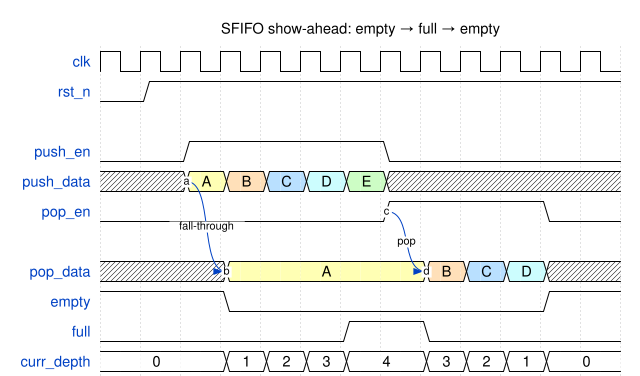
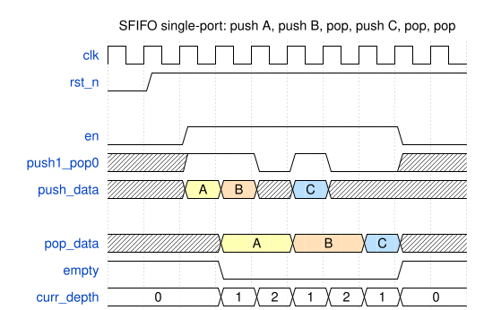
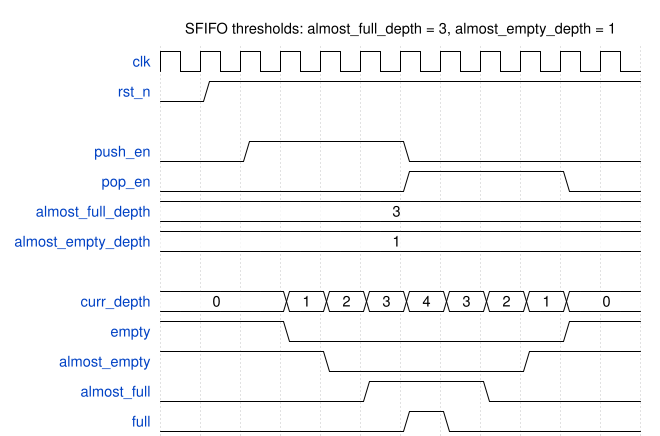

# Module Specification: `SFIFO`

> **Source:** `ts/src/modules/SFIFO/`
> **Status:** Approved

---

## Overview

Synchronous **First-In First-Out** queue backed by an `SRAM` submodule. Supports configurable data width and depth, and optional almost-full/almost-empty thresholds. It can be configured to support simultaneous push and pop with the added expense of a dual port SRAM.

---

## Parameters

| Parameter | Type | Default | Description |
|---|---|---|---|
| `name` | `string` | auto | Instance name |
| `dataWidth` | `IntRange<1,256>` | — | Data word width |
| `depth` | `bigint` | — | Maximum number of entries |
| `simultPushPop` | `boolean` | `true` | `true`: push and pop may occur in the same cycle; storage is a dual-port (`1r_1w`) `SRAM` and the enables are `push_en`/`pop_en`. `false`: push and pop are mutually exclusive; storage is a single-port (`1rw`) `SRAM` and the enables are `en`/`push1_pop0` |
| `inclAlmostFull` | `boolean` | `false` | Enables `almost_full_depth` input and `almost_full` output |
| `inclAlmostEmpty` | `boolean` | `false` | Enables `almost_empty_depth` input and `almost_empty` output |


---

## IO Ports

### Always present

| Port | Direction | Width | Description |
|---|---|---|---|
| `clk` | input | 1 | `posedge` clock |
| `rst_n` | input | 1 | Active-low async reset |
| `push_data` | input | `dataWidth` | Push data |
| `pop_data` | output | `dataWidth` | Head of the queue (valid whenever `empty` is deasserted) |
| `empty` | output | 1 | Asserted when FIFO contains 0 entries |
| `full` | output | 1 | Asserted when FIFO contains `depth` entries |
| `curr_depth` | output | `ceil(log2(depth+1))` | Current fill count (0 to `depth`) |

### `simultPushPop = true`
| Port | Direction | Width | Description |
|---|---|---|----|
| `push_en` | input | 1 | Push enable — writes `push_data` on the next `clk` edge |
| `pop_en` | input | 1 | Pop enable — discards the head entry on the next `clk` edge |

### `simultPushPop = false`
| Port | Direction | Width | Description |
|---|---|---|----|
| `en` | input | 1 | Operation enable — a push or pop occurs on the next `clk` edge, selected by `push1_pop0` |
| `push1_pop0` | input | 1 | Operation select, qualified by `en`: `1` = push, `0` = pop |


### `inclAlmostFull = true`
| Port | Direction | Width | Description |
|---|---|---|----|
| `almost_full_depth` | input | `ceil(log2(depth+1))` | Fill count at which `almost_full` asserts |
| `almost_full` | output | 1 | Asserts when fill ≥ `almost_full_depth` |

### `inclAlmostEmpty = true`
| Port | Direction | Width | Description |
|---|---|---|----|
| `almost_empty_depth` | input | `ceil(log2(depth+1))` | Fill count at or below which `almost_empty` asserts |
| `almost_empty` | output | 1 | Asserts when fill ≤ `almost_empty_depth` |

---

## Functional Description

The FIFO is **show-ahead** (first-word fall-through): `pop_data` always presents the entry at the head of the queue whenever `empty` is deasserted. No read is needed to observe the head — a *pop* discards the current head and advances to the next entry.

Push and pop requests come from different ports depending on `simultPushPop`:

| `simultPushPop` | Push request | Pop request | SRAM |
|---|---|---|---|
| `true` | `push_en` | `pop_en` | `1r_1w` (dual-port) |
| `false` | `en && push1_pop0` | `en && !push1_pop0` | `1rw` (single-port) |

1. `wr_addr` and `rd_addr` are free-running pointers that wrap at `depth`. `rd_addr` always points at the head entry.
2. `fifo_cnt` tracks the number of valid entries; `full` asserts at `depth`, `empty` at 0; `curr_depth` reflects `fifo_cnt`. All status outputs change only on the rising edge of `clk`.
3. **Push:** on a rising edge with a push request and `!full`, `push_data` is written to `SRAM[wr_addr]`; `wr_addr` increments; `fifo_cnt` increments.
4. **Pop:** on a rising edge with a pop request and `!empty`, the head entry is discarded; `rd_addr` increments; `fifo_cnt` decrements. In the following cycle `pop_data` presents the next entry, or becomes undefined if the FIFO is now empty.
5. **Write-to-head latency:** a word pushed into an empty FIFO appears on `pop_data` in the cycle immediately after the push edge — the same cycle that `empty` deasserts. `pop_data` and `empty` always update together, so `!empty` is a sufficient qualifier for `pop_data`.
6. **Simultaneous push and pop** (`simultPushPop = true` only): the net count is unchanged. If the popped entry was the only entry, the pushed word becomes the new head in the following cycle.
   - When `empty`: the pop is ignored and the push proceeds (`push_data` becomes the head).
   - When `full`: the push is ignored and the pop proceeds.
7. With `simultPushPop = false`, at most one operation occurs per cycle, so push and pop can never collide. Each SRAM access (a push write or a pop prefetch read) uses the single port.
8. `pop_data` is undefined while `empty` is asserted. Consumers must qualify `pop_data` with `!empty`.

See [Internal Architecture](#internal-architecture) for how show-ahead is built on an SRAM with a registered read.

### Almost-full / almost-empty

`almost_full` and `almost_empty` are optional early-warning flags with run-time programmable thresholds. They let a producer or consumer react before the FIFO actually fills or drains. They are enabled independently by `inclAlmostFull` and `inclAlmostEmpty`, and behave the same for either `simultPushPop` setting.

| Flag | Asserted when |
|---|---|
| `almost_full` | `fifo_cnt >= almost_full_depth` |
| `almost_empty` | `fifo_cnt <= almost_empty_depth` |

1. Both flags are a combinational compare of the registered `fifo_cnt` against the threshold input, so they change on the same `clk` edge as `curr_depth`, `empty` and `full`. No extra latency is added.
2. The threshold inputs are intended to be static configuration (tied off, or driven from a register). If a threshold changes, the flag follows combinationally in the same cycle.
3. **Using `almost_full` for back-pressure:** if a producer takes *N* cycles to stop pushing after it sees a flag, set `almost_full_depth = depth - N`. Then the pushes still in flight fit in the remaining space and none are dropped.
4. **Using `almost_empty` for bursts:** a consumer that needs a burst of *M* entries can wait for `!almost_empty` with `almost_empty_depth = M - 1`. This guarantees at least *M* entries are available.
5. **Threshold boundary values:**

   | Setting | Result |
   |---|---|
   | `almost_full_depth = depth` | `almost_full` is identical to `full` |
   | `almost_full_depth = 0` | `almost_full` is always asserted |
   | `almost_full_depth > depth` | `almost_full` never asserts |
   | `almost_empty_depth = 0` | `almost_empty` is identical to `empty` |
   | `almost_empty_depth >= depth` | `almost_empty` is always asserted |

### Reset behavior

`wr_addr`, `rd_addr`, and `fifo_cnt` all reset to 0. `empty` asserts, `full` deasserts. `pop_data` is undefined until the first push. With a count of 0, `almost_empty` asserts and `almost_full` deasserts, unless `almost_full_depth = 0`.

### Edge cases

- Pushing when `full`: the push is silently ignored (no overflow protection — caller must check `full`).
- Popping when `empty`: the pop is ignored (no pointer or count change). `pop_data` remains undefined.

---

## Timing

### Dual-port: empty → full → empty

`depth = 4`, `simultPushPop = true`. Four pushes fill the FIFO, a fifth push (`E`) is dropped because `full` is asserted, then four pops drain it. Note that `A` is visible on `pop_data` as soon as `empty` deasserts, without any `pop_en`, and each pop advances `pop_data` to the next entry on the following cycle.

<!-- wavedrom SFIFO-timing-dual-port.svg
{
  "signal": [
    {"name": "clk",        "wave": "p............"},
    {"name": "rst_n",      "wave": "01..........."},
    {},
    {"name": "push_en",    "wave": "0.1....0....."},
    {"name": "push_data",  "wave": "x.34567x.....", "data": ["A", "B", "C", "D", "E"], "node": "..a.........."},
    {"name": "pop_en",     "wave": "0......1...0.", "node": ".......c....."},
    {},
    {"name": "pop_data",   "wave": "x..3....456x.", "data": ["A", "B", "C", "D"], "node": "...b....d...."},
    {"name": "empty",      "wave": "1..0.......1."},
    {"name": "full",       "wave": "0.....1.0...."},
    {"name": "curr_depth", "wave": "=..====.====.", "data": ["0", "1", "2", "3", "4", "3", "2", "1", "0"]}
  ],
  "edge": ["a~>b fall-through", "c~>d pop"],
  "head": {"text": "SFIFO show-ahead: empty → full → empty"}
}
-->


### Single-port: interleaved push and pop

`depth = 4`, `simultPushPop = false`. `en` qualifies every operation and `push1_pop0` selects push (`1`) or pop (`0`). `pop_data` holds the head across push cycles and advances on the cycle after each pop.

<!-- wavedrom SFIFO-timing-single-port.svg
{
  "signal": [
    {"name": "clk",        "wave": "p........."},
    {"name": "rst_n",      "wave": "01........"},
    {},
    {"name": "en",         "wave": "0.1.....0."},
    {"name": "push1_pop0", "wave": "x.1.010.x."},
    {"name": "push_data",  "wave": "x.34x5x...", "data": ["A", "B", "C"]},
    {},
    {"name": "pop_data",   "wave": "x..3.4.5x.", "data": ["A", "B", "C"]},
    {"name": "empty",      "wave": "1..0....1."},
    {"name": "curr_depth", "wave": "=..======.", "data": ["0", "1", "2", "1", "2", "1", "0"]}
  ],
  "head": {"text": "SFIFO single-port: push A, push B, pop, push C, pop, pop"}
}
-->


### Almost-full / almost-empty thresholds

`depth = 4`, `inclAlmostFull = true`, `inclAlmostEmpty = true`, `almost_full_depth = 3`, `almost_empty_depth = 1`. Four pushes then four pops. `almost_empty` is asserted while the count is ≤ 1 and `almost_full` while it is ≥ 3. Both flags change on the same edge as `curr_depth`. `almost_full` asserts one entry before `full`, and `almost_empty` stays asserted one entry past `empty`.

<!-- wavedrom SFIFO-timing-almost-flags.svg
{
  "signal": [
    {"name": "clk",                "wave": "p..........."},
    {"name": "rst_n",              "wave": "01.........."},
    {},
    {"name": "push_en",            "wave": "0.1...0....."},
    {"name": "pop_en",             "wave": "0.....1...0."},
    {"name": "almost_full_depth",  "wave": "=...........", "data": ["3"]},
    {"name": "almost_empty_depth", "wave": "=...........", "data": ["1"]},
    {},
    {"name": "curr_depth",         "wave": "=..========.", "data": ["0", "1", "2", "3", "4", "3", "2", "1", "0"]},
    {"name": "empty",              "wave": "1..0......1."},
    {"name": "almost_empty",       "wave": "1...0....1.."},
    {"name": "almost_full",        "wave": "0....1..0..."},
    {"name": "full",               "wave": "0.....10...."}
  ],
  "head": {"text": "SFIFO thresholds: almost_full_depth = 3, almost_empty_depth = 1"}
}
-->


_In both configurations — write-to-head latency: **1 clock cycle**; pop-to-next-head latency: **1 clock cycle**._

---

## Internal Architecture

`SRAM` has a registered (1-cycle) read, so the head can't be read on demand. Instead, the entry behind the head is read on the pop that exposes it, and a push that becomes the head at once skips the SRAM.

- **Pointers and count:** `wr_addr_q` (next write), `rd_addr_q` (the head) and `fifo_cnt_q`, each computed in an `always_comb` and registered. Every push writes the SRAM, including a push that also goes to `bypass_q`, so the pointers never depend on where the head is shown from.
- **Prefetch:** on a pop with more than one entry, `sram_re` reads `rd_addr_inc`, the entry behind the head. Those entries were written on earlier edges, so the read never hits the address being written. While `sram_re` is low, the SRAM holds its read data, which keeps the head steady across idle and push-only cycles.
- **Bypass:** `bypass_q` captures `push_data` when the push becomes the head at once: a push into an empty FIFO, or (`simultPushPop = true`) a push alongside the pop of the only entry.
- **Head select:** `head_from_bypass_q` records which source holds the head. `pop_data = head_from_bypass_q ? bypass_q : sram_rdata`.
- **SRAM:** `1r_1w` with `simultPushPop = true` (read port on `rd_addr_inc`, write port on `wr_addr_q`). `1rw` otherwise, addressed by `wr_addr_q` on a push and `rd_addr_inc` on a pop.
- **`depth = 1`:** the only entry is always the head, so there is no SRAM and no pointers; `pop_data` is `bypass_q`.

### Key signals

| Signal | Width | Description |
|---|---|---|
| `push_fire` / `pop_fire` | 1 | Push / pop request accepted this cycle (`!full` / `!empty`) |
| `fifo_cnt_q` | `ceil(log2(depth+1))` | Entries held; drives `curr_depth`, `empty`, `full` and the almost flags |
| `wr_addr_q`, `rd_addr_q` | `ceil(log2(depth))` | SRAM address of the next write and of the head |
| `rd_addr_inc` | `ceil(log2(depth))` | `rd_addr_q + 1`, wrapping at `depth`: the prefetch address |
| `sram_re` | 1 | `pop_fire && fifo_cnt_q > 1`: prefetch the next head |
| `load_bypass` | 1 | The pushed word becomes the head on this edge |
| `bypass_q` | `dataWidth` | Last pushed word that became the head directly; not reset |
| `head_from_bypass_q` | 1 | The head is in `bypass_q` (1) or on the SRAM read data (0) |

---

## Dependencies

| Import | Source |
|---|---|
| `Module`, `TSSVParameters`, `IntRange`, `Expr` | `tssv/lib/core/TSSV` |
| `SRAM` | `tssv/lib/modules/SRAM` |

---

## Test Plan

**Test script:** `ts/test/modules/test_SFIFO.ts` generates every combination of `simultPushPop`, `inclAlmostFull` and `inclAlmostEmpty` (at `depth = 5`), checks each one's ports against the IO tables above, and generates the testbench configurations below.
**Testbench:** `verilatorTB/tb_SFIFO.sv`, built once per configuration. Every cycle, a queue reference model checks `empty`, `full`, `curr_depth`, the almost flags and, while not empty, `pop_data`.
**Output:** `sv-examples/SFIFO/<module>/` and `sv-examples/SFIFO/tb/`

| Configuration | `depth` | `simultPushPop` | Almost flags |
|---|---|---|---|
| `d8_dual_flags` | 8 | `true` | both |
| `d4_dual_flags` | 4 | `true` | both |
| `d4_single` | 4 | `false` | none |
| `d5_single_flags` | 5 | `false` | both |
| `d1_dual` | 1 | `true` | none |

| Test case | Configurations | Notes |
|---|---|---|
| Show-ahead | all | Push 1 word; it is on `pop_data` the cycle `empty` deasserts, with no pop |
| Fill to full | all | Push `depth` words, verify `full`; one more push is dropped |
| Drain to empty | all | Pop `depth` words in order, verify `empty`; one more pop is ignored |
| Simultaneous push/pop | `simultPushPop = true` | At count 0 (pop ignored), 1 (pushed word becomes the head), `depth/2` (count unchanged) and `depth` (push ignored); then `4 × depth` back-to-back cycles of both |
| Single-port interleave | `d4_single` | The single-port timing diagram |
| Almost-full / almost-empty thresholds | with almost flags | `almost_full_depth = depth - 2`, `almost_empty_depth = 2`, fill then drain |
| Threshold boundaries | with almost flags | `almost_full_depth = depth` tracks `full`; `almost_empty_depth = 0` tracks `empty` |
| Threshold sweep | with almost flags | Every representable threshold, including values above `depth`, fill then drain |
| Timing diagrams | `d4_dual_flags`, `d4_single` | Each diagram in [Timing](#timing) replays cycle for cycle. `test_SFIFO.ts` builds the vectors from the diagrams' WaveDrom JSON, so a diagram change is tested without editing the testbench |
| Random | all | 3000 cycles of random pushes and pops in fill-biased, drain-biased and balanced phases, with thresholds changed every 50 cycles |

### Simulation

```bash
make -C verilatorTB sfifo_sim    # generates the SV, then builds and runs each configuration
# waveform per configuration: verilatorTB/obj_dir/sfifo_<config>/tb_SFIFO_<config>.fst
```
