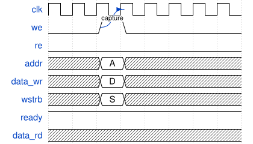
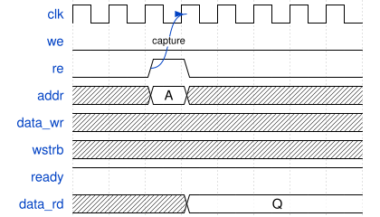
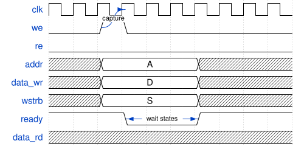
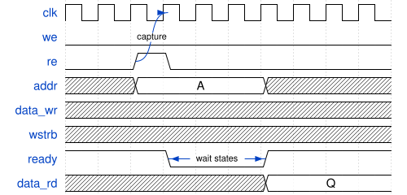

[**tssv**](README.md)

***

[tssv](README.md) / Memory

# Memory

## Classes

### Memory

A simple memory bus. It is not pipelined, and only one access is outstanding at a time. A
master drives it through an `outward` port and a slave answers through an `inward` port.
`APB_to_Memory` is a master, and `RegisterBlock`'s `regs` port is a slave.

#### Why these signals

The signals are chosen so that a slave can drive a synchronous SRAM macro with them, with
minimal glue logic. A synchronous SRAM starts one access on each clock edge where its enable
is high. The master raises `WE` or `RE` for exactly one cycle, so each request starts exactly
one access. An enable held high for several cycles would repeat the access on every edge. The
SRAM's registered output then holds the read data until its next access, which is what the
`DATA_RD` rule below asks for.

`ADDR` is a byte address, the address software uses. It needs no logic to convert it, but the
slave's RTL must select the word-address bits from it. With `B = DATA_WIDTH / 8` bytes per
word, the word address is `ADDR[ADDR_WIDTH-1:$clog2(B)]`. The low `$clog2(B)` bits pick a byte
within the word, and a slave that stores whole words ignores them. `WSTRB` says which bytes of
the word a write changes.

#### Handshake

- **Request.** The master raises `WE` or `RE`, never both, for exactly one cycle, and only
  while `READY` is high. The slave captures the request on the next rising `clk` edge.
- **Hold.** The master holds `ADDR`, and for a write `DATA_WR` and `WSTRB`, from the request
  cycle until `READY` is high again. With a slave that has no wait states, that is the request
  cycle only. With one that has wait states, a slow slave can keep using them without
  capturing them first.
- **`READY`** is high while the bus holds the last settled access. A slave that needs wait
  states drops it from the cycle after the request until the access settles. A slave with no
  wait states keeps it high. A synchronous SRAM with a one-cycle read can tie it high.
- **`DATA_RD`.** After a read, it is valid in every cycle `READY` is high, and holds until the
  next request. After a write it is undefined.
- **`WSTRB`** has one bit per byte of `DATA_WR`: bit `i` enables `DATA_WR[8*i+7:8*i]`. Its
  width is `ADDR_WIDTH / 8` today instead of `DATA_WIDTH / 8`
  ([#81](https://github.com/TypeScriptSystemVerilog/TSSV/issues/81)).

In the diagrams, the arrow marks the `clk` edge that captures the request, and the span on
`ready` marks the wait states the slave inserts.

#### Wavedrom

Zero-wait write

<!-- wavedrom Memory-zero-wait-write.svg
{
  "signal": [
    {"name": "clk",      "wave": "p.......", "node": "...C"},
    {"name": "we",       "wave": "0.10....", "node": "..A"},
    {"name": "re",       "wave": "0......."},
    {"name": "addr",     "wave": "x.=x....", "data": ["A"]},
    {"name": "data_wr",  "wave": "x.=x....", "data": ["D"]},
    {"name": "wstrb",    "wave": "x.=x....", "data": ["S"]},
    {"name": "ready",    "wave": "1......."},
    {"name": "data_rd",  "wave": "x......."}
  ],
  "edge": ["A~>C capture"]
}
-->



#### Wavedrom

Zero-wait read

<!-- wavedrom Memory-zero-wait-read.svg
{
  "signal": [
    {"name": "clk",      "wave": "p.......", "node": "...C"},
    {"name": "we",       "wave": "0......."},
    {"name": "re",       "wave": "0.10....", "node": "..A"},
    {"name": "addr",     "wave": "x.=x....", "data": ["A"]},
    {"name": "data_wr",  "wave": "x......."},
    {"name": "wstrb",    "wave": "x......."},
    {"name": "ready",    "wave": "1......."},
    {"name": "data_rd",  "wave": "x..=....", "data": ["Q"]}
  ],
  "edge": ["A~>C capture"]
}
-->



#### Wavedrom

Write with wait states

<!-- wavedrom Memory-write-with-wait-states.svg
{
  "signal": [
    {"name": "clk",      "wave": "p.........", "node": "...C"},
    {"name": "we",       "wave": "0.10......", "node": "..A"},
    {"name": "re",       "wave": "0........."},
    {"name": "addr",     "wave": "x.=...x...", "data": ["A"]},
    {"name": "data_wr",  "wave": "x.=...x...", "data": ["D"]},
    {"name": "wstrb",    "wave": "x.=...x...", "data": ["S"]},
    {"name": "ready",    "wave": "1..0..1...", "node": "...D..E"},
    {"name": "data_rd",  "wave": "x........."}
  ],
  "edge": ["A~>C capture", "D<->E wait states"]
}
-->



#### Wavedrom

Read with wait states

<!-- wavedrom Memory-read-with-wait-states.svg
{
  "signal": [
    {"name": "clk",      "wave": "p.........", "node": "...C"},
    {"name": "we",       "wave": "0........."},
    {"name": "re",       "wave": "0.10......", "node": "..A"},
    {"name": "addr",     "wave": "x.=...x...", "data": ["A"]},
    {"name": "data_wr",  "wave": "x........."},
    {"name": "wstrb",    "wave": "x........."},
    {"name": "ready",    "wave": "1..0..1...", "node": "...D..E"},
    {"name": "data_rd",  "wave": "x.....=...", "data": ["Q"]}
  ],
  "edge": ["A~>C capture", "D<->E wait states"]
}
-->



#### Extends

- [`Interface`](Base.md#interface)

#### Constructors

##### Constructor

```ts
new Memory(params?, role?): Memory;
```

###### Parameters

| Parameter | Type | Default value |
| ------ | ------ | ------ |
| `params` | [`Memory_Parameters`](#memory_parameters) | `{}` |
| `role` | [`Memory_Role`](#memory_role) | `undefined` |

###### Returns

[`Memory`](#memory)

###### Overrides

[`Interface`](Base.md#interface).[`constructor`](Base.md#constructor-2)

#### Properties

| Property | Type | Overrides |
| ------ | ------ | ------ |
| <a id="params"></a> `params` | [`Memory_Parameters`](#memory_parameters) | [`Interface`](Base.md#interface).[`params`](Base.md#params-1) |
| <a id="signals"></a> `signals` | `object` | [`Interface`](Base.md#interface).[`signals`](Base.md#signals-1) |
| `signals.ADDR` | `object` | - |
| `signals.ADDR.width` | \| `16` \| `17` \| `18` \| `19` \| `20` \| `21` \| `22` \| `23` \| `24` \| `25` \| `26` \| `27` \| `28` \| `29` \| `30` \| `31` \| `32` \| `33` \| `34` \| `35` \| `36` \| `37` \| `38` \| `39` \| `40` \| `41` \| `42` \| `43` \| `44` \| `45` \| `46` \| `47` \| `48` \| `49` \| `50` \| `51` \| `52` \| `53` \| `54` \| `55` \| `56` \| `57` \| `58` \| `59` \| `60` \| `61` \| `62` \| `63` \| `64` | - |
| `signals.DATA_WR` | `object` | - |
| `signals.DATA_WR.width` | `32` \| `64` \| `128` \| `256` \| `512` \| `1024` | - |
| `signals.DATA_RD` | `object` | - |
| `signals.DATA_RD.width` | `32` \| `64` \| `128` \| `256` \| `512` \| `1024` | - |
| `signals.RE` | `object` | - |
| `signals.RE.width` | `number` | - |
| `signals.WE` | `object` | - |
| `signals.WE.width` | `number` | - |
| `signals.READY` | `object` | - |
| `signals.READY.width` | `number` | - |
| `signals.WSTRB` | `object` | - |
| `signals.WSTRB.width` | `number` | - |

## Interfaces

### Memory\_Parameters

Parameters of a [Memory](#memory) bus.

#### Extends

- [`TSSVParameters`](Base.md#tssvparameters)

#### Indexable

```ts
[name: string]: ParameterValue | undefined
```

#### Properties

| Property | Type | Description | Inherited from |
| ------ | ------ | ------ | ------ |
| <a id="name"></a> `name?` | `string` | - | [`TSSVParameters`](Base.md#tssvparameters).[`name`](Base.md#name) |
| <a id="data_width"></a> `DATA_WIDTH?` | `32` \| `64` \| `128` \| `256` \| `512` \| `1024` | Width of `DATA_WR` and `DATA_RD` in bits. Default 32. | - |
| <a id="addr_width"></a> `ADDR_WIDTH?` | \| `16` \| `32` \| `64` \| `17` \| `18` \| `19` \| `20` \| `21` \| `22` \| `23` \| `24` \| `25` \| `30` \| `36` \| `26` \| `27` \| `28` \| `29` \| `31` \| `33` \| `34` \| `35` \| `37` \| `38` \| `39` \| `40` \| `41` \| `42` \| `43` \| `44` \| `45` \| `46` \| `47` \| `48` \| `49` \| `50` \| `51` \| `52` \| `53` \| `54` \| `55` \| `56` \| `57` \| `58` \| `59` \| `60` \| `61` \| `62` \| `63` | Width of `ADDR` in bits. `ADDR` is a byte address. Default 32. | - |

## Type Aliases

### Memory\_Role

```ts
type Memory_Role = "outward" | "inward" | undefined;
```

`outward` is a master's port, `inward` is a slave's port, and `undefined` is a local bundle
that is not a port.
